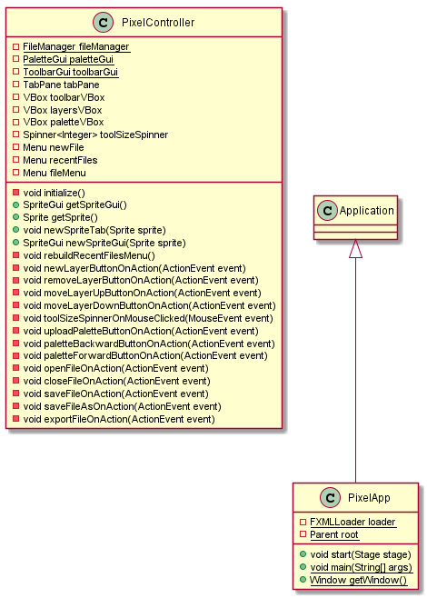
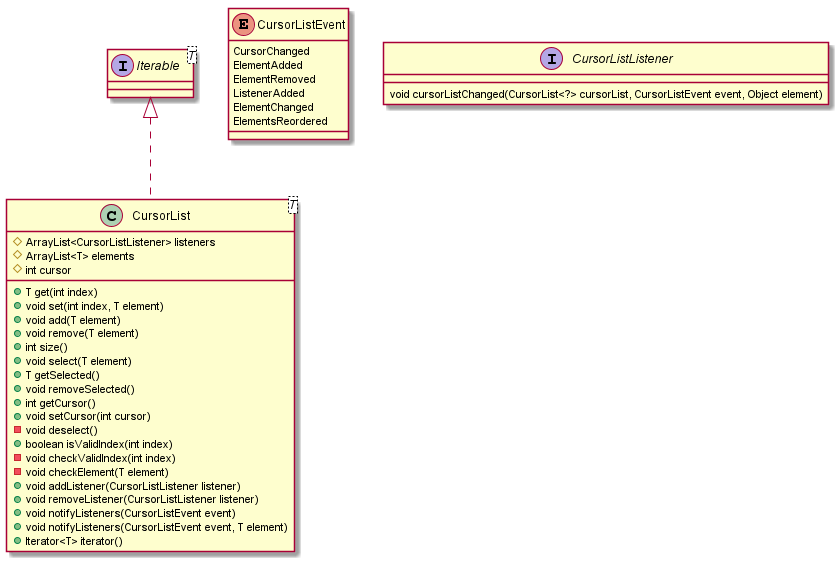
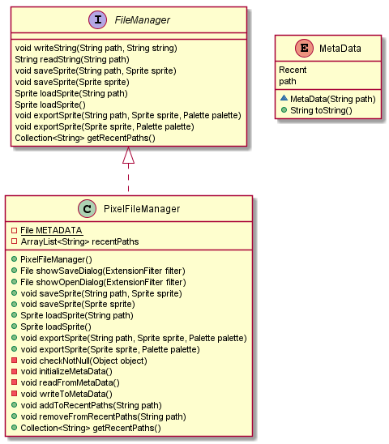
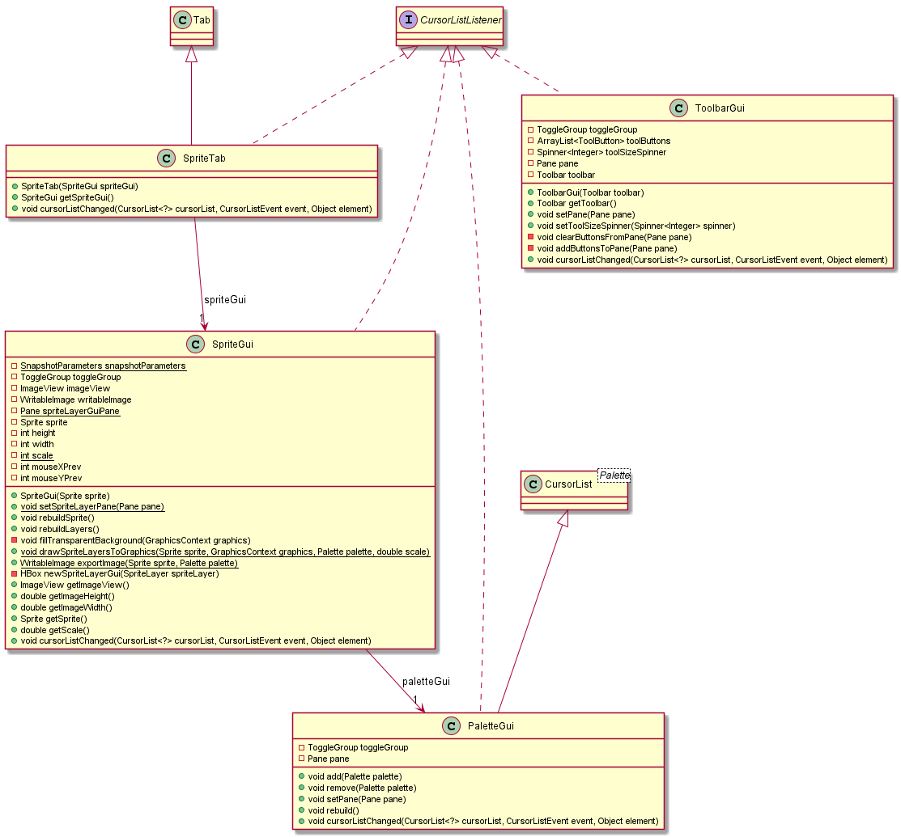
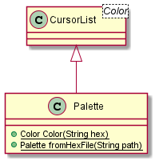
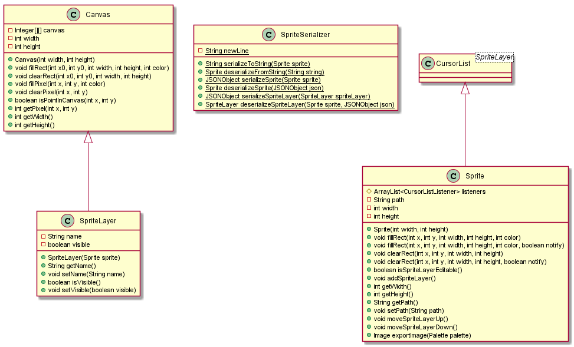
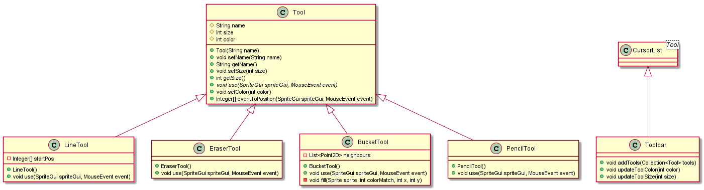

# Pixel - a simple pixel editor.

- Index painting
- Layers
- Palettes
- Save and load .pixel files
- Export to .png
- Tools:
    - Pencil
    - Eraser
    - Bucket
    - Line

## UML

### pixel

### pixel.cursorlist

### pixel.file

### pixel.gui

### pixel.palette

### pixel.sprite

### pixel.tool

